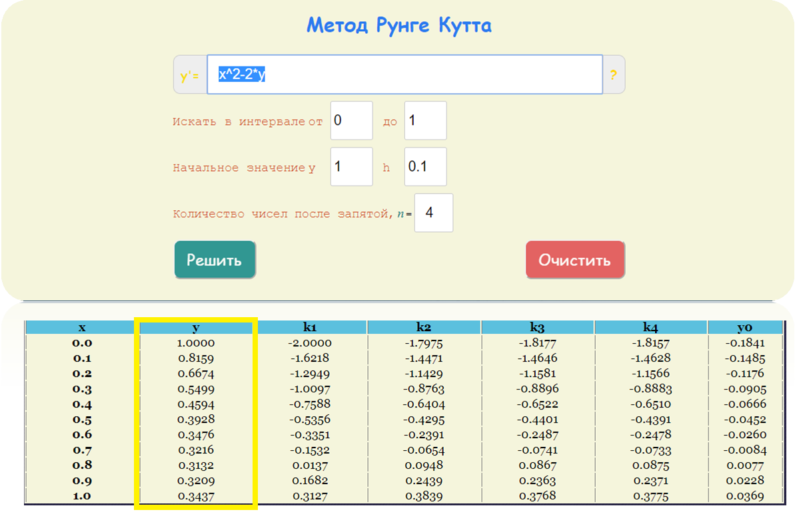

# Калькулятор | Метод Рунге-Кутта 4-порядка

Численный метод решение задачи Коши для дифференциальных уравнений  (ru)

Numerical method for solving the Cauchy problem for differential equations (eng)

link to calculator - [https://baktybek0v.github.io/Runge-Kutta4-Calculator/](https://baktybek0v.github.io/Runge-Kutta4-Calculator/)


#### Example

```
функция       - f(x) = x^2 - 2y   
интервал      - [0, 1]
начальная y   - y(0) = 1
шаг           - h1 = 0.1

```


